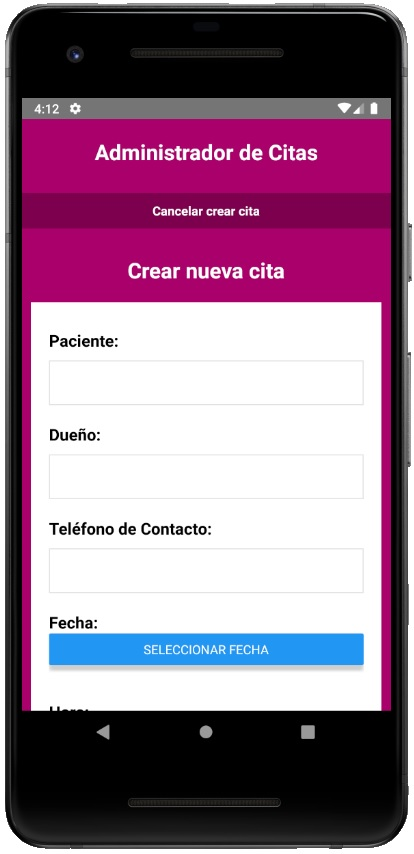

# App para citas veterinarias realizada con React Native

Update: se agregó el AsyncStorage para mantener las citas despues de recargar la app.

- Para comenzar ejecute:
`npm install`

- Para correr en el emulador o en su celular ejecute (android):
`npx react-native run-android`

- Para correr en el emulador o en su celular ejecute (ios):
`npx react-native run-ios`

## Vista Previa:

